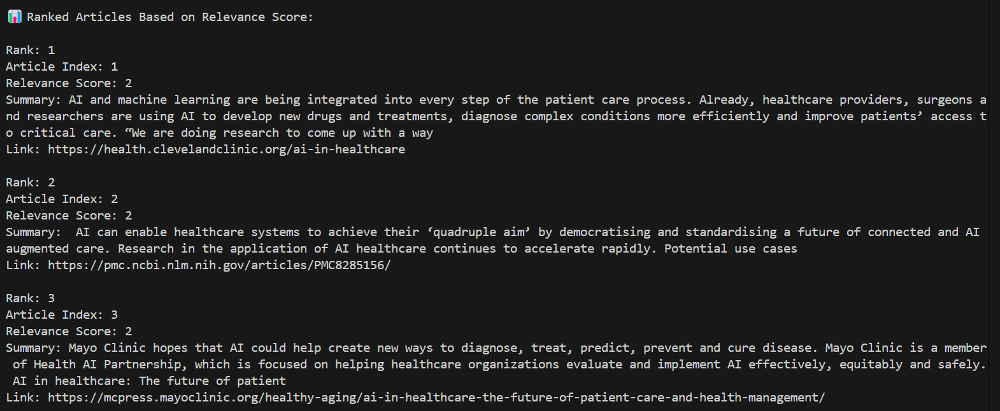
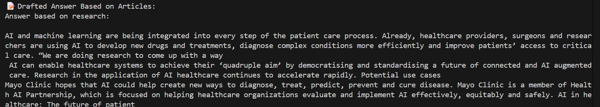

# AI agent-based Deep Research


An AI-powered research assistant that fetches, summarizes, ranks, and drafts answers from real-time web articles based on your research query.

Built with Python, Tavily API, Hugging Face Transformers, and LangGraph.

---


## ✨ Features
🔎 Web Search: Fetches articles related to your query using Tavily API.

📝 Summarization: Condenses long articles into short summaries using BART-large CNN model from Hugging Face.

📈 Relevance Scoring: Scores articles based on how closely they match your query.

📊 Article Ranking: Ranks articles from most to least relevant.

🧠 Drafted Answer Generation: Combines article summaries into a detailed research answer.

🌐 Simple CLI Interface: Just input your query and get results!

This aligns with the assignment goal of designing an **AI Agent-based Deep Research System**.
---

## 📂 Project Structure

```mermaid
flowchart TD
    A[ResearchFlow/] --> B(fetch_data.py)
    A --> C(summarize.py)
    A --> D(main.py)
    A --> E(.env)
    A --> F(requirements.txt)
    A --> G(README.md)

---

## 📁 Folder Structure

```
researchflow/
│
├── fetch_data.py            # Fetch search results from Tavily API
├── summarize.py             # Summarize articles and calculate relevance
├── main.py                  # Entry point to run the full research pipeline
│
├── .env                     # API keys (DO NOT upload this publicly)
├── requirements.txt         # Python dependencies
└── README.md                 # Project documentation (you're reading it!)

```

---

### ⚙️ Setup Instructions

1. **Clone the repository**
   ```bash
    git clone https://github.com/ANKIT-WADHWA/Tavily-deep-research-ai-agent.git
    cd Tavily-deep-research-ai-agent

   ```

2. **Install dependencies**
   ```bash
   pip install -r requirements.txt
   ```

3. **Create `.env` with your API keys**
   ```env
    TAVILY_API_KEY=your-tavily-key
    HUGGINGFACEHUB_API_TOKEN=your-api-key
   ```

---


### Run the pipeline

```bash
python main.py
```

## This script will:
- Crawl websites using the Tavily API to gather search results based on a given query.

- Summarize and score content using HuggingFace's BART model for summarization and a basic relevance score based on query matching.

- Ingest the results into LangGraph for structured data processing and organization into states for further handling.

- Retrieve relevant articles based on the query, sort them by relevance score, and display the most valuable content.

- Draft a final answer by combining the best summaries from the ranked articles into a comprehensive response.

---

## ✅ Example Output

```
## Description
Add query after running python main.py


```

### 2️⃣ Gmail Preview
Ranked Article based on Relevance Score:

---

### 3 Answer based on research:
 Drafted Answer Based on Articles
 
---


## Contact
Email:ankitwadhwa2004@gmail.com